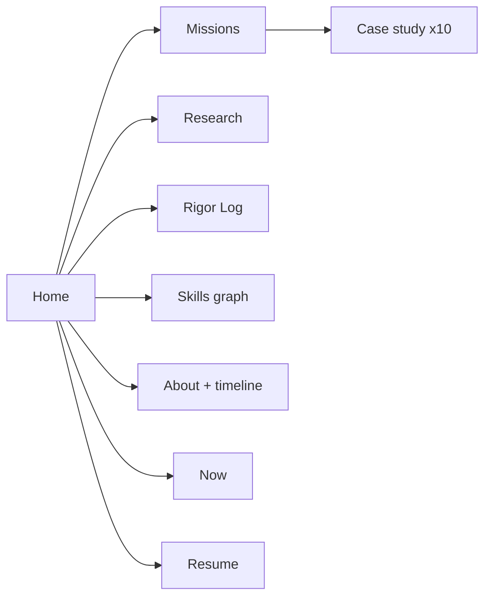

# Sankalp Singh Portfolio: Build Plan and Claude Code Prompt

2026-09-19 · @Someone

## 1. Concept: "The Second Metric"

The site is a mission-control console for an engineer whose real skill is catching what looks right but is wrong. Most student portfolios say "I built X". Yours says "I built X, and here is the subtle bug I caught by checking a second, independent metric". Nobody else can copy that, because it comes from your actual work.

The theme is already in your projects:

- **SkyScout:** the "right on one metric, wrong underneath" lesson, caught 15+ times (the 187x gyro-frame test, the hinge overlap hidden across 9 design changes).
- **Grokking paper:** "A Lead Time Is Not a Detection", a whole paper about measurement honesty.
- **surrogate-trust-audit:** a pre-registered null model (a deliberately dumb baseline) that beat every trust signal, reported honestly.
- **Swarm defence sim:** honest degradation in fog and wind, instead of hiding bad weather results.

**One-line identity (draft):** "I build simulations at the edge of machine learning and mathematical modelling, then try hard to prove them wrong."

**Three unique ideas that make it yours:**

1. **Mission mode / Paper mode.** Dark theme = a mission-control HUD (heads-up display). Light theme = an arXiv-style paper page. The theme switch shows both halves of you: builder and researcher.
2. **A live Mars hero.** The first screen is your SkyScout world (seed 20260808) drawn in the browser. A scout drone flies, and a hazard map fills in below it. A "Truth / Estimate" switch shows how the drone's belief drifts from reality.
3. **The Rigor Log.** A page that lists real bugs you caught, each with "first metric said", "second metric said", "fix". This is the page recruiters and professors will remember.

**Audience, in order:** master's admission committees (Germany, Netherlands, Norway, USA), research supervisors, then ML / robotics / autonomy recruiters.

## 2. Content inventory (source of truth)

Every fact on the site must come from this section. Claude Code must not invent numbers, dates or tools. Anything marked **(confirm)** needs your check first.

### Identity

| Field | Value |
| --- | --- |
| Name | Sankalp Singh (goes by S) |
| Degree | B.Tech, Artificial Intelligence & Data Science, GGSIPU Delhi. Awarded May 2026 (provisional certificate). First two years: mathematics and physics |
| Goal | Specialist at the intersection of machine learning and mathematical modelling |
| Next step | International M.Sc. for 2027 (Computational Science, Scientific Computing, CS, Robotics). Germany, Netherlands, Norway, USA |
| GitHub | github.com/Sankalp895 |
| LinkedIn | linkedin.com/in/sankalp-singh-420b3a246 |
| Public email | sankalp895@gmail.com |
| Languages spoken | Hindi (native), English (IELTS 8.0), German (learning, A2 target) |
| Certifications | Aeromodelling Certification. IELTS 8.0 sits with the spoken languages on the current resume |

### Flagship missions (hero projects)

| Project | What it is | Proof numbers | Stack |
| --- | --- | --- | --- |
| **SkyScout** | Autonomous Mars scout drone that maps hazards from above and hands safe routes to a rover. Full pipeline: CAD body, GPS-denied localisation, planning, perception, cinematic render | Rover 35 links / 34 joints, drone 21 / 20 (\~218 CAD solids). Dead reckoning drifted 10.9 m in 14.4 s; ESKF (error-state Kalman filter, a sensor-fusion method) crushed the drift and recovered the true sensor biases. Final position error 197.57 m uncorrected against 0.38 m corrected over a 40 s flight with 39 fixes (brain/b2_step4_correct.json). Hazard map F1 0.92, recall 0.97, coverage 99.95% against ground truth (brain/b4_step3_mapping.json). Consistency checked with ANEES. 80 x 80 m procedural Mars, seed 20260808 | build123d / OpenCASCADE, URDF / SRDF / SDF (robot description files), Genesis physics (headless, Mars gravity 3.72), MuJoCo, NumPy, Blender 4.5. Repo: github.com/Sankalp895/skyscout-mars (public) |
| **Adversarial Swarm Defence Sim** | 3D drone-swarm threat simulator. A GAN (generative adversarial network) learns to disguise attacks; a defence learns to catch them | Generator output scale 6.0, after a bare Tanh reached under 40% of the real feature range and the critic separated real from fake by magnitude alone (broke run 1). minibatch-std + DiffAugment delayed mode collapse only to epoch ~55 against ~145 without them, on a 560-sample dataset (10 features x 99 timesteps), so both were disabled on that evidence. threat\_patrol centroid drift stays irreducible while a fast converging attack run is fully disguisable. Detection percentages are not public: the evaluation notebook outputs are not committed | WGAN-GP, TCN (temporal convolutional network), multi-sensor fusion (radar / optical / acoustic / RF), Three.js + Python over WebSocket. Repo: github.com/Sankalp895/adversarial-swarm-defense (public) |
| **Paper: A Lead Time Is Not a Detection** | Audits "early warning" signals for grokking (when a network suddenly generalises long after memorising). Shows reported lead times are partly artefacts of measurement rules | Fourier signal led 8/8 seeds by median \~2,600 steps under a strict pre-registered rule; weight\_norm fired 0/8; replicated on subtraction 5/5 | PyTorch, LaTeX. Preprint, S. Singh 2026. No public repo |
| **Paper: Surrogate Trust Audit** | Can we tell when a neural PDE surrogate (a fast learned stand-in for a physics solver, e.g. FNO, PINN) is wrong? Negative result: a matched-capacity input-only null model beats every trust signal tested | Null model registered as primary before results; code and full audit trail public | FNO, PINN, probes, ensembles. Preprint, S. Singh 2026. 178 pytest test functions. github.com/Sankalp895/surrogate-trust-audit (public) |

### Other projects

| Project | One line | Proof / stack |
| --- | --- | --- |
| **CompliSense** | AI legal-compliance platform for Indian SMEs. Dissertation with Parth, supervised by Dr. Ashish Joshi | BERT NER (named-entity recognition) 84.8% macro F1, XGBoost + SHAP, PostgreSQL 16 + pgvector, Neo4j 5. Zero-cost deploy: Supabase, Render, Vercel, AuraDB. No public repo |
| **Inertial Ghost** | GPS-denied drone navigation. Fuses IMU, VIO (visual odometry) and UWB (ultra-wideband ranging) in an ESKF | Python filter core, A\* planning, Godot 4 visualisation. Repo: github.com/Sankalp895/inertial-ghost (public) |
| **regexray** | Zero-dependency regex debugger and ReDoS (regex denial-of-service) analyser. Solo hackathon entry | Python stdlib only: hand-written tokeniser, parser, backtracking matcher, Thompson NFA simulator. Solo hackathon entry. No public repo |
| **HireScope** | AI resume analyser | FastAPI, React, spaCy, sentence-transformers, FAISS, Redis, OCR (Tesseract); 87% ATS pass rate. Deployed on Hugging Face Spaces. Live demo: hire-scope-gules.vercel.app. Repo: github.com/Sankalp895/HireScope-AI-Resume-Analyzer (public) |
| **inkless** | Markdown to a typeset PDF, with the PDF format written out byte by byte. Zero dependencies, standard library only | requirements.txt is 0 bytes. 151 test functions (52 table-driven with subTest), 5,433 engine lines against 2,886 test lines. A rebuild in an empty virtualenv is byte-identical by SHA-256 (deps-proof.txt). A syntax-tree test forbids importing time, datetime, calendar, random, uuid and re. Repo: github.com/Sankalp895/inkless (public) |
| **Supernova Simulation** | Interactive 3D stellar evolution. Mass decides whether the star leaves a nebula, a pulsar or a black hole | Three.js, GLSL shaders, vanilla JS. An independent headless NumPy prototype of 10,000 particles cross-checks the physics; committed logs confirm the velocity clamp holds at 30.00 across all steps and the bounce triggers at mean radius 11.81 against a 15.0 threshold. MATH.md documents the equations. Repo: github.com/Sankalp895/Super_nova_simulations (public) |
| **Global Weather Forecasting** | Temperature and humidity over 108,353 observations, where the honest finding is that the ensemble bought almost nothing | Six models on one split: Random Forest test R2 0.9414, LightGBM 0.9413, Linear 0.9410, Ridge 0.9410, XGBoost 0.9408, Lasso 0.9259. Random Forest beats plain linear regression by 0.0004 R2 and overfits (train 0.983 against test 0.941). Stacking ensemble 0.9441, gaining 0.003. 34 engineered features, SHAP, Streamlit dashboard, MIT. Repo: github.com/Sankalp895/global-weather-forecasting- (public) |
| **GLCM Texture Analysis** | Image texture features built from scratch (GLCM = grey-level co-occurrence matrix) | NumPy, Pillow, Matplotlib, Flask. No computer vision library is used. Reused later in SkyScout perception. Repo: github.com/Sankalp895/Image-Texture-Analysis (public) |

### Experience (newest first)

| Role | Org | Dates | Highlights |
| --- | --- | --- | --- |
| Backend Developer / ML | Product Manager Accelerator, USA (remote) | Sep 2025 to Jan 2026 | StylePilot AI fashion platform: PostgreSQL schema (8+ models, SQLAlchemy), FastAPI backend, pgvector similarity search, CV pipeline (Gemini + SAM + CLIP), recommender, RAG chatbot. Team placed 2nd at showcase |
| AI/ML Intern | Prodigal AI, Delhi | Jul to Aug 2025 | Dockerised startup health-scoring app (Streamlit), RAG + OCR pipelines, Apache Airflow workflows, 4-person team |
| Student Research Intern, AI for Drug Discovery | GGSIPU | May to Jun 2024 | Led ML in a team of 5: RDKit molecular fingerprints, Random Forest + ANN bioactivity prediction for colon-cancer compounds |

### Skills (every skill must link to a project that proves it)

| Group | Skills |
| --- | --- |
| Languages | Python, SQL, JavaScript, Java, GLSL. C++ was on an earlier list, is not on the resume, and appears in none of the 16 public repos, so it is dropped. Java is on the resume with no public project to link it to |
| ML / DL | PyTorch, TensorFlow, scikit-learn, XGBoost, LightGBM, SHAP, GANs (WGAN-GP), TCNs, Transformers (BERT), FNO, PINN |
| Scientific computing | NumPy, SciPy, Kalman filtering (ESKF), factor graphs, IMU pre-integration, spectral methods, Crank-Nicolson, A\* planning |
| Robotics and simulation | URDF / SRDF / SDF, build123d CAD, Genesis, MuJoCo, Godot 4, Three.js, Blender (bpy), OpenCV, GLCM, Bayesian log-odds mapping |
| LLM and data | RAG, FAISS, pgvector, sentence-transformers, spaCy, OCR (Tesseract). SAM, CLIP and the Gemini API come from the StylePilot work |
| Backend and infra | FastAPI, Flask, React, PostgreSQL, Neo4j, Redis, SQLAlchemy, Docker, Apache Airflow, Azure, Git, pytest. Also WebSocket, Streamlit, Vercel, Render, Supabase, AuraDB, WSL2, Pandas, Hugging Face Spaces |
| Research practice | Pre-registration, null models, multi-seed studies, convergence tests, filter consistency (NEES) |
| Currently learning | Cybersecurity (TryHackMe track), LLM systems engineering (evals, caching, serving), German |

## 3. Site map and page content

Nine routes. The home page must work alone for a 30-second visitor; the deeper pages serve professors who read carefully.



| Route | Purpose | What goes on it |
| --- | --- | --- |
| `/` Home | Hook in 30 s | Mars hero with Truth / Estimate switch; identity line; status bar ("Current mission: M.Sc. 2027"); 3 flagship mission cards; 2 paper cards; a Rigor Log ticker; contact buttons |
| `/missions` | All projects | Grid of mission cards, filter chips (Robotics, Research, ML, Backend, Security); each card flips to show its "second metric" |
| `/missions/[slug]` | Case study | Fixed structure: Problem, Approach, System diagram, Results (numbers + plots), The bug I caught, Limits and what I'd do next, Stack, Links. Reads like a short paper, written in a human voice |
| `/research` | Papers | Title, status badge (Under review / Preprint / Published), abstract in plain English, key figure, links (PDF, code, OpenReview), BibTeX copy button |
| `/rigor-log` | Signature page | 8 to 12 entries: "First metric said / Second metric said / Fix / Lesson". Seed entries: 187x gyro-frame test, bias convergence proof, hinge overlap hidden by distance check, correct "no path" via connected components, lookahead controller flying 3.4x too fast, capture vs project split, weight\_norm 0/8, embed\_eff\_rank false positive, null model beating the probe |
| `/skills` | Evidence map | Interactive graph: skill nodes linked to project nodes. Click a skill, the projects that prove it light up. No percentage bars |
| `/about` | The person | Short story (maths + physics start, aeromodelling, into ML + modelling), vertical timeline 2022 to 2027, spoken languages, photo |
| `/now` | Fresh signal | What you're doing this month: applications, German, cybersecurity, LLM engineering. Dated, updated monthly |
| `/resume` | Recruiters | Clean HTML resume + PDF download (your existing LaTeX resume) |

Global extras: `Ctrl+K` command palette (jump to any page or project), a hidden terminal (type `help`, `missions`, `whoami`), a footer with GitHub, LinkedIn, email and "last deployed" date.

## 4. Design system and signature interactions

The look is "Mars mission control meets a research paper": dark telemetry panels in Mission mode, clean serif pages in Paper mode, with Mars rust as the one strong accent.

### Colour tokens

| Token | Mission mode (dark) | Paper mode (light) | Use |
| --- | --- | --- | --- |
| `--bg` | #0B0D12 deep space | #F7F4EE paper | Page background |
| `--panel` | #12161F | #FFFFFF | Cards, HUD panels |
| `--ink` | #E6E3DA | #1A1A1A | Body text |
| `--muted` | #8A8F9C | #5E5E5E | Labels, captions |
| `--accent` | #D9582B Mars rust | #B8431A | Links, highlights, the drone |
| `--verified` | #5BD69A | #1F8A55 | "Second metric passed" badges |
| `--warn` | #F2B84B | #A86B00 | "Under review", open issues |
| `--grid` | #1E2430 | #E6E0D4 | HUD grid lines, borders |

### Type

- **Headlines and long prose:** Newsreader (a serif with a scientific-paper feel).
- **Data, labels, HUD, code:** JetBrains Mono.
- **UI text (buttons, nav):** Inter Tight.
- All from Google Fonts, with system fallbacks. Numbers use tabular figures (fixed-width digits) so telemetry does not jump.

### Signature interactions

1. **Mars hero (Three.js).** Procedural terrain from seed 20260808 (crater, ridge, boulders). A low-poly drone flies a lawnmower survey path; a 2D hazard mini-map fills in as it goes. Truth / Estimate switch: in Estimate view the drone's ghost drifts, then snaps back when a "fix" arrives. On phones or low-power devices, show a pre-rendered Blender still or short loop instead.
2. **Flip cards.** Front: headline metric. Back: "What the first metric hid".
3. **Mini demos (small canvas widgets):** ESKF drift vs correction on a 2D path; an animated grokking curve (train vs test accuracy with the predictor firing); optional regex ReDoS step counter.
4. **Skill evidence graph:** force-directed graph (nodes pulled by springs), skills to projects.
5. **HUD status bar** at top: UTC clock, "Current mission", "Location: Delhi, IN", "Status: open to M.Sc. 2027 and internships".
6. **Command palette + terminal easter egg.**

### Rules

- Respect `prefers-reduced-motion` (turn off heavy animation for users who ask).
- No skill-percentage bars, no stock icons grid, no generic "hi, I'm a passionate developer" copy.
- Every number shown links to its source (repo, paper, figure).
- Lighthouse scores of 90+ on Performance, Accessibility, Best Practices and SEO.

## 5. Tech stack, repo layout, zero-cost hosting

Astro + React islands (only the interactive parts load JavaScript) keeps the site fast, and the whole thing costs nothing until you buy the domain.

| Layer | Choice | Why |
| --- | --- | --- |
| Framework | Astro 5 | Static pages by default, very fast; MDX content collections (typed Markdown files for each project) |
| Interactive parts | React islands | Hero, graph, demos, palette load only where used |
| 3D | Three.js via react-three-fiber + drei | You already know Three.js from the swarm sim |
| Styling | Tailwind CSS 4 + CSS variables for the two themes | Tokens from section 4 |
| Animation | Motion (formerly Framer Motion) | Respects reduced motion |
| Graph | d3-force | Skill evidence graph |
| Search / palette | cmdk | Command palette |
| OG images | Astro + satori | Auto social preview card per page |
| Hosting | Vercel free tier (you used it for CompliSense) | Custom domain later in one step |
| Analytics | Vercel Web Analytics or Umami (free) | Privacy-friendly |
| Contact | mailto + Formspree free tier | No backend needed |
| Node | Node 22 LTS in WSL2 (your Node 18 is end-of-life) | Astro 5 needs a current Node |

```text
portfolio/
  PORTFOLIO_BRIEF.md        <- this doc, exported as Markdown
  src/
    content/
      missions/*.mdx        <- one file per project (frontmatter = facts)
      research/*.mdx        <- one file per paper
      rigor-log/*.md        <- one file per caught bug
    data/
      profile.ts  experience.ts  skills.ts  now.ts
    components/
      hud/  cards/  hero/  demos/  graph/  palette/
    layouts/  pages/  styles/tokens.css
  public/
    media/<project>/        <- screenshots, Blender renders, plots
    resume/Sankalp_Singh_CV.pdf
```

Rule: page components never hold facts. All facts live in `content/` and `data/`, validated with Zod schemas (a type check for data), so a missing field fails the build instead of shipping a blank.

## 6. Build plan: 11 phases, one shippable output each

About 11 to 14 Claude Code sessions. Every phase ends with a running site you can open, so you never have a half-built mess.

| Phase | Ships | Done when |
| --- | --- | --- |
| P0 Setup | Astro repo in WSL2, Git, Vercel preview link | `npm run build` passes and a blank page is live on a Vercel URL |
| P1 Design system | tokens.css, fonts, Mission / Paper theme switch, HUD status bar, nav, footer | Both themes pass contrast checks; switch remembered per visitor |
| P2 Content layer | Zod schemas + all MDX / data files filled from section 2 | Build fails if any required fact is missing; no invented numbers |
| P3 Home (static) | Identity, flagship cards, paper cards, Rigor ticker, contact | Home reads well with JavaScript turned off |
| P4 Mars hero | Three.js terrain (seed 20260808), drone survey, mini-map, Truth / Estimate switch, mobile fallback | 60 fps on desktop, static fallback on phones and reduced motion |
| P5 Missions | Index with filters + flip cards, case-study template, SkyScout and Swarm pages fully written | Two case studies read like short papers, with images |
| P6 Research + Rigor Log | Both papers with status badges and BibTeX; 8 to 12 Rigor Log entries | Every entry has first metric / second metric / fix |
| P7 Skills, About, Now, Resume | Evidence graph, timeline, Now page, HTML resume + PDF | Every skill links to at least one project |
| P8 Mini demos | ESKF drift demo, grokking curve demo | Each demo under 50 KB of JavaScript, lazy-loaded |
| P9 Delight | Command palette, terminal, 404 page ("no path found", like your A\* result) | Keyboard-only navigation works |
| P10 Polish + launch | SEO, OG images, sitemap, Lighthouse 90+, humanised copy pass, custom domain | Domain live over HTTPS |

Remaining case studies (CompliSense, Inertial Ghost, regexray, HireScope, GLCM, drug discovery) can be written in P5 or P10, using the same template.

## 7. The master prompt for Claude Code

Export this doc as Markdown, save it as `PORTFOLIO_BRIEF.md` in an empty `portfolio/` folder, open Claude Code there, and paste the prompt below. For each later session, paste the short "next phase" line at the end.

```text
You are my senior front-end engineer and design partner. We are building my personal
portfolio website, phase by phase. I work on Windows 11 inside WSL2 (Ubuntu 24.04),
VS Code over the WSL remote extension. Budget: zero cost beyond my Claude subscription.

READ FIRST
Read PORTFOLIO_BRIEF.md in the repo root, fully, before doing anything. It is the single
source of truth:
- Section 1: concept ("The Second Metric", Mission mode / Paper mode, Mars hero, Rigor Log)
- Section 2: every fact about me (projects, numbers, jobs, skills)
- Section 3: site map and page content
- Section 4: design tokens, fonts, signature interactions, rules
- Section 5: stack and repo layout
- Section 6: the phase plan with "done when" checks

NON-NEGOTIABLE RULES
1. Facts: use ONLY facts from Section 2. Never invent a number, date, tool, award or
   outcome. Anything marked "(confirm)" is rendered with a visible TODO marker and listed
   back to me at the end of the session.
2. Honesty labels: distinguish "verified result", "under review", "planned". Authored
   presentation motion (e.g. the hero animation) is labelled as illustration, not sim output.
3. Writing style: simple English, short sentences, first person, human voice. It must not
   read as AI-generated: no "passionate", "leveraging", "cutting-edge", "delve",
   "seamless", no rule-of-three fluff. NO EM DASHES anywhere, in copy or comments; rewrite
   the sentence instead. Gloss any technical term in brackets the first time it appears.
4. Facts live in src/content and src/data only, validated with Zod. Components hold no facts.
5. Performance and access: Lighthouse 90+ on all four scores, prefers-reduced-motion
   respected, keyboard navigable, mobile first, static fallback for all 3D.
6. My machine has AMD integrated graphics and no GPU: keep the 3D scene light (low-poly,
   instancing, capped pixel ratio) and measure fps.

HOW WE WORK
- One phase per session. At the start, restate the phase goal and its "done when" check
  from Section 6, then list the files you will create or change. Then build.
- Build first, minimal explanation. Every session must ship something I can open.
- After building: run `npm run build`, fix all errors, run the dev server, and tell me
  exactly what to look at in the browser.
- Check a SECOND metric before calling anything done (e.g. it builds AND it looks right
  on a 375 px phone width; fps is fine AND reduced-motion fallback works).
- Commit at the end of each phase with a clear message.
- End each session with: what shipped, what to check, open TODOs (confirm items),
  and the next phase.

START NOW: Phase P0 + P1.
P0: scaffold Astro 5 with React, MDX, Tailwind 4, TypeScript strict; set up Git and the
folder layout from Section 5; add a README; tell me the exact commands to link Vercel.
P1: build tokens.css with both themes from Section 4, load the three fonts, the
Mission / Paper theme switch (saved in localStorage, respects system preference), the
HUD status bar, top nav for all Section 3 routes (placeholder pages), and the footer.
Stop after P1 and show me.
```

**Next-phase line (paste at the start of each later session):**

```text
Read PORTFOLIO_BRIEF.md again. We are on Phase P<N>. Follow all non-negotiable rules from
the first session. Restate the goal and "done when", list files, build, verify with a
second metric, commit, and report.
```

## 8. What you must supply, and launch checklist

I know your projects well, but not your links, images or the latest outcomes. Gather these before P2.

### To gather

- [x] Professional photo (square, plain background). Cropped square and live on /about
- [x] Resume PDF (your latest LaTeX build) — LinkedIn and email also now filled into section 2
- [x] GitHub repo links: SkyScout, Swarm sim, Inertial Ghost, HireScope, GLCM and surrogate-trust-audit are public and linked. CompliSense, regexray and the grokking paper have no public repo and the site says "Code not public"
- [ ] Media: SkyScout Blender renders and HUD frames, swarm sim screenshots (4C to 4G), grokking plots, surrogate-trust-audit figures, CompliSense screenshots, Inertial Ghost Godot clip
- [ ] InterpScience decision (due Sep 29, 2026) and arXiv link if posted
- [ ] regexray hackathon result (winners were due Sep 15)
- [ ] Confirm frameworks: PyTorch for the papers? Any C++?
- [ ] Whether CompliSense has a live demo URL, and Parth's okay to show it
- [ ] Domain shortlist (e.g. sankalpsingh.dev, sankalp.space, a Mars-flavoured one)

### Keep off the site

- University enrollment number, phone number, home address
- Recruiter names and interview details (e.g. Blue River)
- Anything under review that the venue asks you to keep anonymous (check the InterpScience policy before linking the paper)

### Launch checklist

- [ ] All "(confirm)" TODOs cleared
- [ ] Copy read aloud once: no em dashes, no AI-sounding phrases
- [ ] Lighthouse 90+ on mobile and desktop
- [ ] Tested on a phone, a low-end laptop, and with reduced motion on
- [ ] OG preview checked on LinkedIn Post Inspector
- [ ] Domain bought, connected in Vercel, HTTPS on
- [ ] Site link added to resume, LinkedIn, GitHub profile README, and every SOP / CV for the 2027 applications
